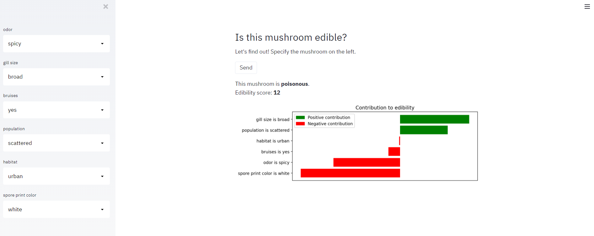

# mushroom_webapp
This web app decides if a mushroom is edible or poisonous and explains the prediction.
You can specify the odor, gill size, bruises, population, habitat and spore print color.
If you press send, you'll see the prediction and explanation.
The explanation is build with shap, and the model was 100% accurate.
The dataset is from kaggle. URL: https://www.kaggle.com/uciml/mushroom-classification

## Steps to get the web app working
1. Create a new environment. Conda example: `conda create --name mushroom python=3.8 pip`
2. Activate the environment. Conda example: `conda activate mushroom`
3. Install the requirements via `pip install -r requirements.txt`
4. Enter the command: `streamlit run mushroomapp.py` 
5. Go to localhost in your web browser

Enjoy!
